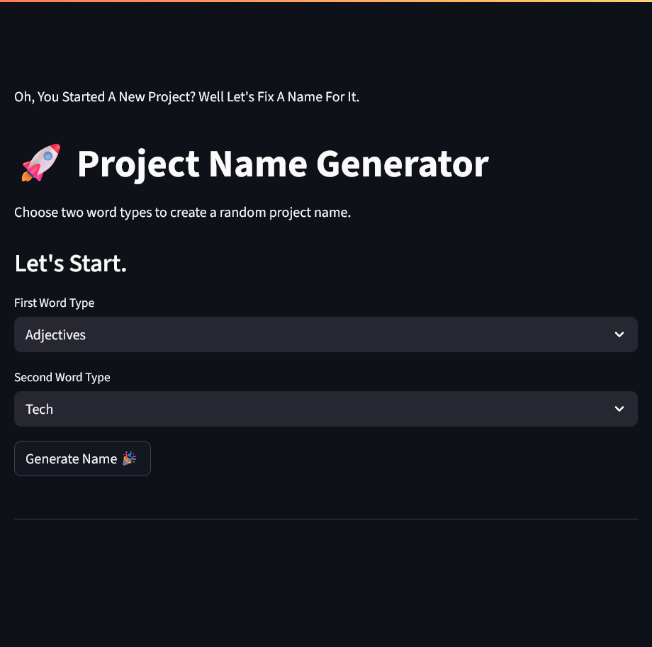
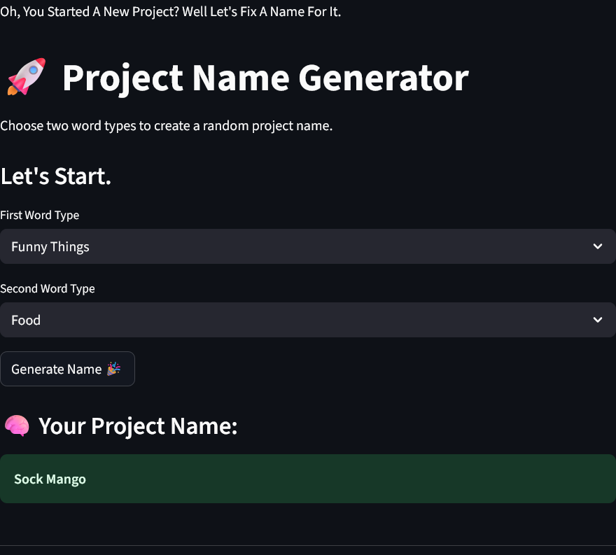
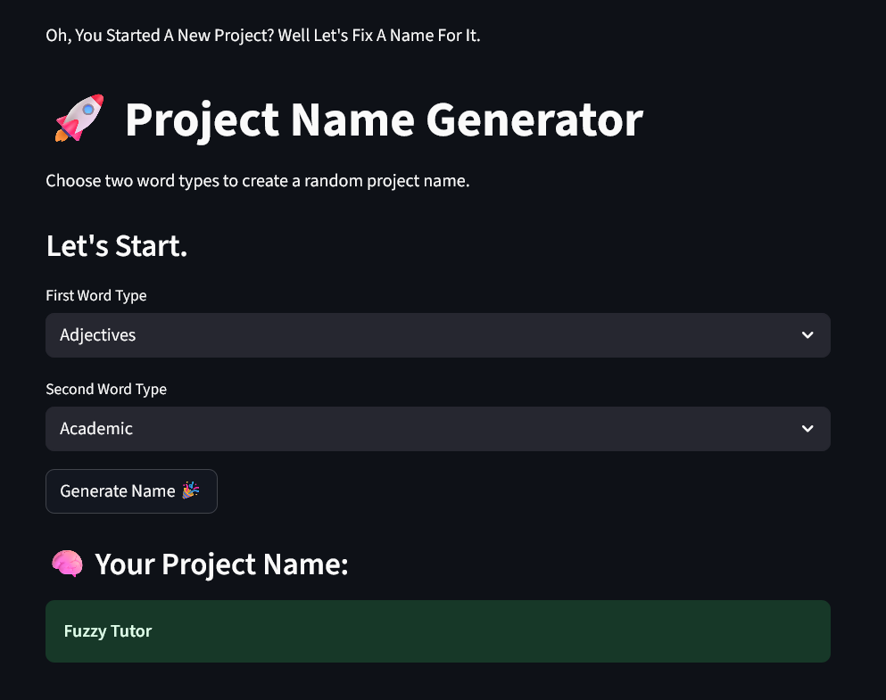
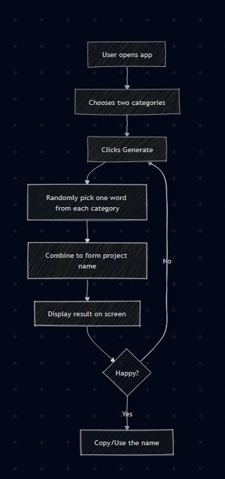

# Project Name Generator 🎯


## Basic Details
### Team Name: Somebody


### Team Members
- Team Lead: Muhammed Midhlaj K - TKM College of Engineering

### Project Description
A chaotic Streamlit app that gives your boring project a random, over-the-top name using buzzwords from AI, food, animals, and more.This is the ultimate procrastination tool disguised as productivity.

### The Problem (that doesn't exist)
Too many projects. Not enough ridiculous names.Your project deserves a name that sounds like it was created by a VC-fueled fever dream.
You can't let your proffessor think that you spent all night fixing a name.

### The Solution (that nobody asked for)
A buzzword blender that helps you combine "Quantum" with "Toaster", or "Hyper" with "Cactus", to create names your team will never forget (or be able to explain).

## Technical Details
### Technologies/Components Used
For Software:
- Python 🐍
- Streamlit 👑
- random 🎲

For Hardware:
- A (not so)Working Brain 🧠

### Implementation
For Software:
# Installation
```bash
pip install streamlit
git clone https://github.com/midhlaj-K/Project-Name-Generator.git
```

# Run
for Windows,
```bash
python.exe -m streamlit run main.py
```
Others,
```bash
streamlit run main.py
```

### Project Documentation
For Software:

# Screenshots (Add at least 3)

*This is the screen that you see at first*


*Now you got an output*


*Now you got another output*

# Diagrams

### Project Demo
# Video

*You choose the first and second word, and let the magic do it's work with each click*


## Team Contributions
- Muhammed Midhlaj K - All Of It.All Alone. 😢

---
Made with ❤️ at TinkerHub Useless Projects 


